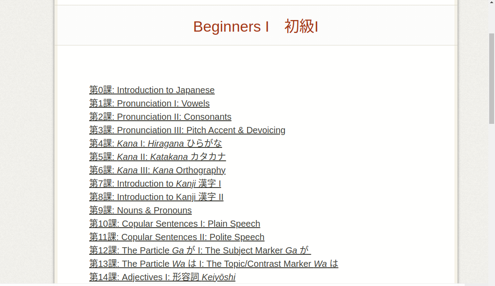

Back when I was 12, many of my friends could speak more than one language. One is their national language, and the other is their parent's language. I started to think of how cool they are because their brain can store multiple "communication style" at the same time. 

My parents never taught me to learn their hometown language, as they think it does not really important. So I just spoke one language at that time.

On 2022, after learning a bit of English, I started studying Japanese. Honestly it felt more difficult because I did not only learn the vocabularies, but also the writing system. But I just want to keep going and move forward.

## Why I learn Japanese

Actually before I decided to learn Japanese, I almost chose a few other languages like Arabic, Chinese, and Polish. 

I almost chose Arabic and Chinese because I think it just widely used by other people, while Polish have such a cool words on every phrase. "Wziąć prysznic", "wszystkie szepty w jeden ciepły krzyk", these is just very cool words.

But all of those languages does not really have any other important purpose than just to be learned. So at the end I chose Japanese because it just more useful for me. 

By learning it, I will be able to understands all the dialogues in my favorite movies. Also, Japan has this cool writing system called Katakana where we can convert our name to it.

```
アリフ (Arifu) - My name in Katakana
```

## What is my target

At this time I do not really put much effort into learning Japanese. Mostly because beside this language, I am also trying to learn more about Web Development and improve my programming skills. 

I do not want to learn too much things at the same time because it will caused burnout and will take away all my motivations.

But my target is clear and I have all the roadmap. I just want to be able to understand what people say and be able to reply to them. 

I probably want to be able to understand the kanji as well. But I did not really care and learn much about how to write in Japanese, as I think I will rarely using that skill in the real world.

## What steps do I take to achieve

Because my background is programming, I tend to learn things from articles. So I found this cool site called [IMABI](https://imabi.net/), where I can learn basic Japanese like verbs and particles.



But this alone will not be enough, so I often tried to talk with other Japanese learners on Discord and Reddit. 

On Discord, there is a server called [Japanese Language Study Space](https://discord.com/invite/jlss) and it is such a cool forum. 

Also there is a few Subreddits where we can find many resources and ask anything about Japanese. Some of them is [r/LearnJapanese](https://www.reddit.com/r/LearnJapanese/), [r/NHKEasyNews](https://www.reddit.com/r/NHKEasyNews/), and [r/SpeakJapanese](https://www.reddit.com/r/SpeakJapanese/).

## List of my resources

Here are some of my resources when I studying Japanese:

- https://www.imabi.net/, where I can read articles about basic Japanese.
- https://www.mlcjapanese.co.jp/, same as above, but with a different interface.
- https://www3.nhk.or.jp/news/, where I can practive my Japanese reading skills.
- https://jlptstudy.net/, where I can try to memorize all the kanji.

Those and many others sites have helped me to learn and increase my progress.

## My motivations

Sometimes I just losing all my motivations and started to wonder why am I studying all this stuff. But I believe on phrase "A man should have a skill".

If I did not learn anything, I would be just like any other ordinary people and have nothing to be proud of.

I have to study hard in order to prove myself worthy.
